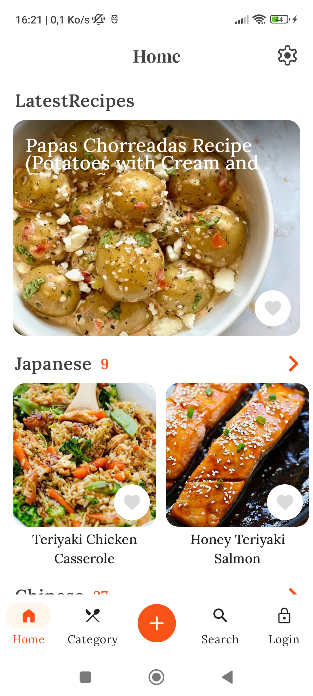
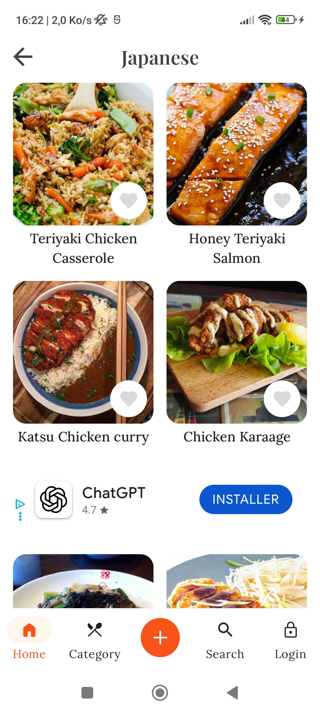
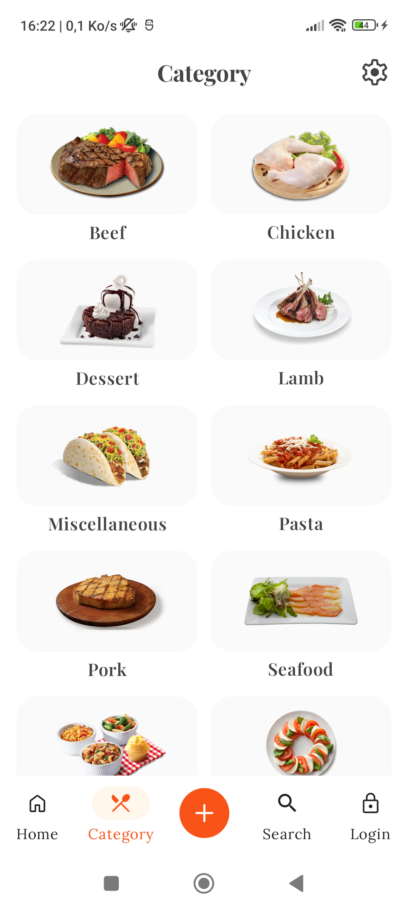
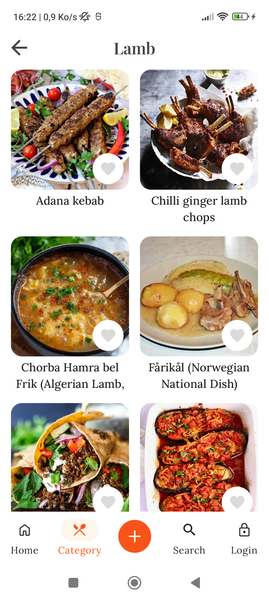
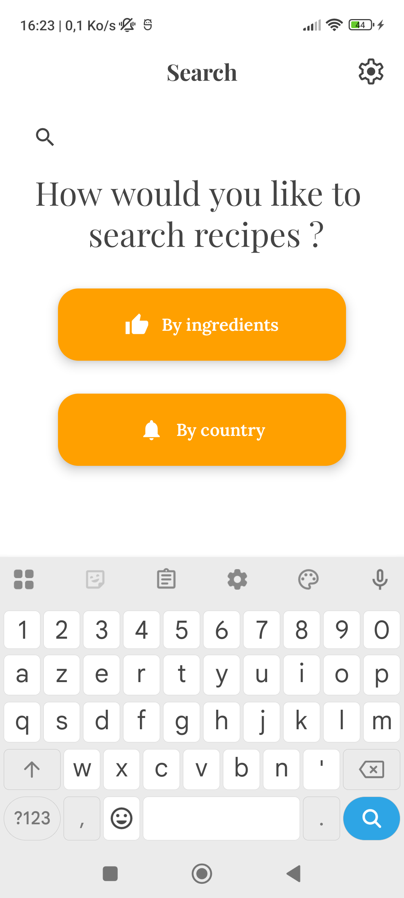
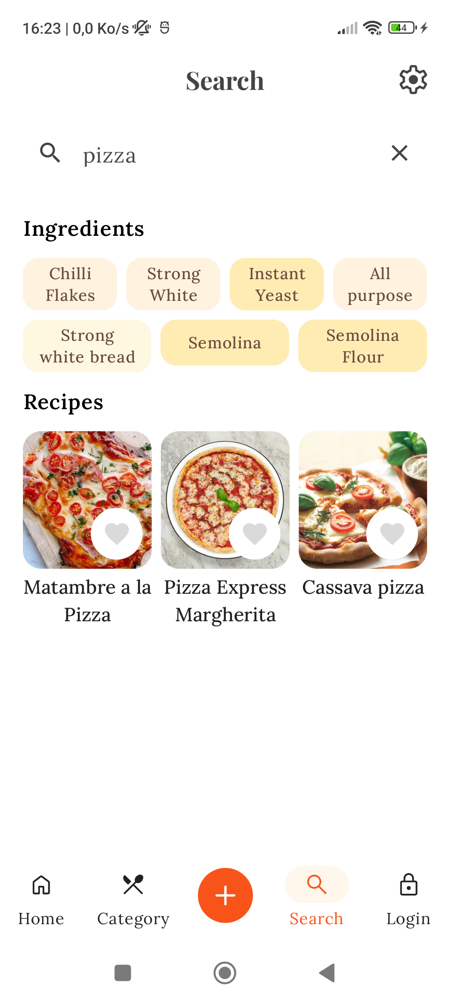
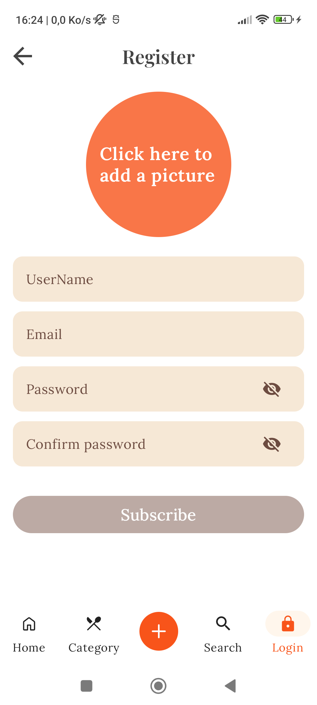
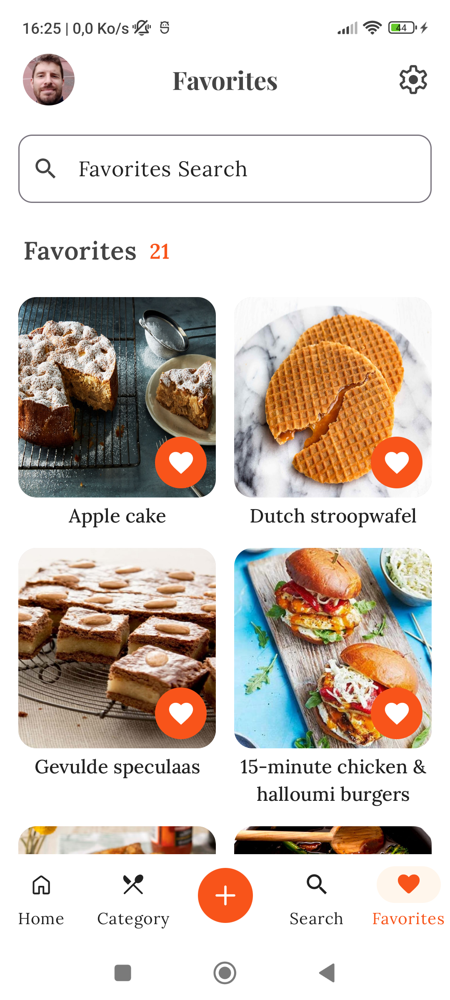
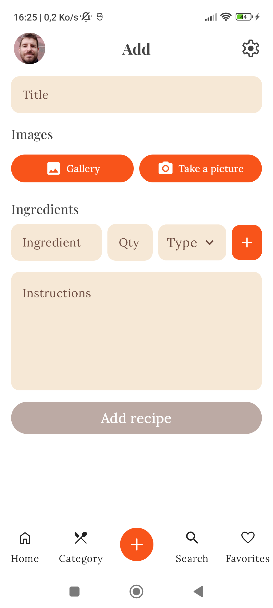
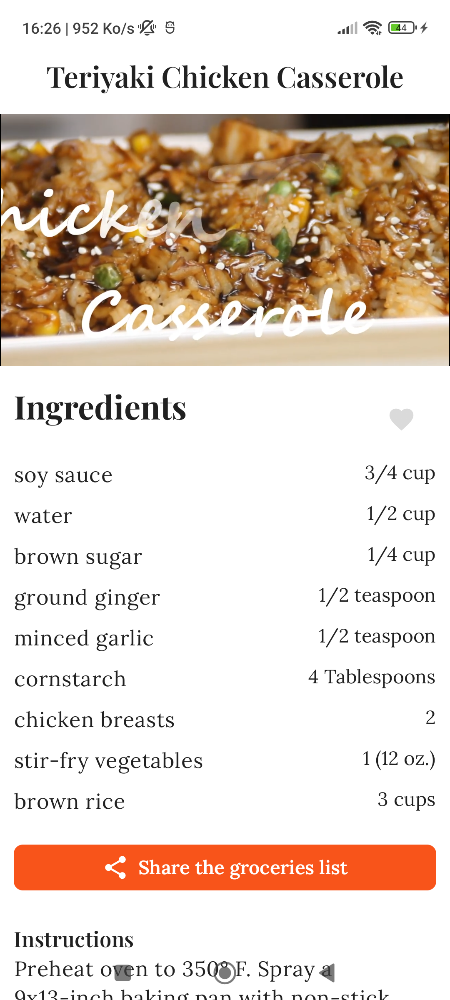

# MyRecipesStore

A native Android app that serves cooking recipes from around the world. Create an account to save your favorites, browse by category or cuisine, watch recipe videos, and add your own recipes.


> **Status:** actively developed · current version `1.2.9`

---

## 📸 Screenshots

<table>
  <tr>
    <td align="center"></td>
    <td align="center"></td>
    <td align="center"></td>
    <td align="center"></td>
    <td align="center"></td>
  </tr>
  <tr>
    <td align="center"><b>Home</b><br/>latest &amp; cuisine feeds</td>
    <td align="center"><b>Cuisine section</b><br/>browse by area</td>
    <td align="center"><b>Categories</b></td>
    <td align="center"><b>Category recipes</b></td>
    <td align="center"><b>Search</b><br/>by ingredients / country</td>
  </tr>
  <tr>
    <td align="center"></td>
    <td align="center"></td>
    <td align="center"></td>
    <td align="center"></td>
    <td align="center"></td>
  </tr>
  <tr>
    <td align="center"><b>Search results</b></td>
    <td align="center"><b>Register</b></td>
    <td align="center"><b>Favorites</b></td>
    <td align="center"><b>Add recipe</b></td>
    <td align="center"><b>Recipe detail</b><br/>ingredients &amp; sharing</td>
  </tr>
</table>

---

## ✨ Features

- **Discover recipes** — curated home feed (latest, Japanese, English and per-area sections)
- **Search** — by category, cuisine/area or ingredient
- **Recipe detail** — ingredients, instructions and embedded video, with an adaptive list/detail layout in landscape
- **Favorites** — save recipes to a personal list (offline-first, syncs when back online)
- **Add your own recipes** — create and edit custom recipes with images
- **Accounts** — email/password, Google Sign-In ; profile management and password reset
- **Premium** — subscriptions via Google Play Billing
- **Adaptive UI** — phone (bottom bar) and large-screen/tablet (navigation rail) layouts, edge-to-edge
- **Plus** — push notifications (FCM), in-app updates & reviews, ads with consent management

---

## 🏗️ Architecture

Modern Android following Google's official guidance: reactive, single-activity, clean architecture with a **multi-module** setup.

```
UI (Screen / ViewModel)  →  Domain (Use Cases)  →  Data (Repositories → Network / Database)
```

- **UI:** Jetpack Compose + Material 3
- **State:** Unidirectional Data Flow with Coroutines & `Flow`; ViewModels expose `StateFlow<UiState>` via `SharingStarted.WhileSubscribed(5_000)`
- **Presentation:** feature modules follow **MVI** — a single `State`, a sealed `Action`, and one-shot `Event`s. ViewModels expose `StateFlow<State>` + `onAction(Action)`
- **DI:** Hilt
- **Navigation:** Navigation3 for Compose — type-safe and declarative, with a custom `Navigator` managing multiple back stacks
- **Data:** Repository pattern aggregating Room (local) and Retrofit/OkHttp (remote)
- **Persistence:** Room (structured) + Proto DataStore
- **Background:** WorkManager for deferrable work and data sync

### Feature module pattern

Each feature is split in two modules to keep navigation contracts decoupled from implementations:

- **`:feature:<name>:api`** — public `@Serializable` `NavKey` + a `Navigator.navigateTo<Name>()` extension
- **`:feature:<name>:impl`** — `Route`, `Screen`, `ViewModel`, delegates and DI module

```
feature/<name>/impl/src/main/java/com/francotte/<name>/
├── <Name>Route.kt      # Composable entry point, obtains hiltViewModel()
├── <Name>Screen.kt     # UI (Compose previews live here)
├── <Name>ViewModel.kt  # @HiltViewModel, exposes StateFlow<State>, emits Event
├── delegate/           # Reusable logic extracted from the ViewModel (optional)
└── di/                 # Hilt module
```

---

## 🧩 Module structure

**App & infra**

| Module | Role |
|--------|------|
| `:app` | Entry point, DI setup, top-level navigation |
| `:sync` | Background data synchronization |
| `:benchmark` | Baseline profile + performance benchmarks |

**Core** (`core/`)

| Module | Role |
|--------|------|
| `:core:model` | Domain models shared across modules |
| `:core:network` | Retrofit + OkHttp, API interfaces, Kotlinx Serialization |
| `:core:database` | Room database, DAOs, migrations, schemas |
| `:core:data` | Repositories aggregating network + database |
| `:core:datastore` / `:core:datastore-proto` | Proto DataStore |
| `:core:domain` | Use cases / business logic |
| `:core:common` | Shared utilities, extensions |
| `:core:ui` | Shared Composables (outside the design system) |
| `:core:designsystem` | Material 3 theme, typography, colors, design tokens |
| `:core:auth` | Email/Password, Google Sign-In |
| `:core:billing` | Google Play Billing |
| `:core:notifications` | Firebase Cloud Messaging |
| `:core:navigation` | Type-safe navigation state |
| `:core:ads` / `:core:cmp` | AdMob + consent management |
| `:core:premium` | Premium/subscription features |
| `:core:web` | WebView integration |
| `:core:inapp-update` / `:core:inapp-rating` | Google Play In-App Update & Review |
| `:core:shared-prefs` | SharedPreferences helpers |
| `:core:testing` / `:core:screenshot-testing` | Test utilities + Roborazzi screenshot testing |

**Features** (`feature/`) — each with an `api` + `impl` pair

`home` · `search` · `detail` · `add_recipe` · `favorites` · `login` · `register` · `profile` · `reset` · `categories` · `section` · `video` · `settings` · `ads` · `inapp-update` · `inapp-rating`

---

## 🚀 Getting started

### Prerequisites

- **Android Studio** (latest stable) with **JDK 17**
- **Android SDK** with `compileSdk 36`

### Configuration

Two files are required but **not committed** (they hold secrets):

1. **`app/src/main/java/com/francotte/myrecipesstore/api/ApiKey.kt`** — API keys used by the app. Ask the maintainer for the expected shape, e.g.:
   ```kotlin
   package com.francotte.myrecipesstore.api

   object ApiKey {
       const val BASE_URL = "..."
       // ...other keys
   }
   ```
2. **`keystore.properties`** (repo root) — release signing only; not needed for debug builds:
   ```properties
   storeFile=/absolute/path/to/release-keystore.jks
   storePassword=...
   keyAlias=...
   keyPassword=...
   ```

`local.properties` (SDK path) is generated automatically by Android Studio.

### Build & run

```bash
./gradlew assembleDebug          # Debug APK
./gradlew installDebug           # Build + install on a connected device/emulator
./gradlew assembleRelease        # Signed release APK
./gradlew bundleRelease          # Signed AAB for the Play Store
```

---

## 🧪 Testing & quality

```bash
./gradlew test                   # Unit tests (JUnit + MockK)
./gradlew connectedAndroidTest   # Instrumented tests (Espresso + orchestrator)
./gradlew check                  # Lint + ktlint + detekt + tests
```

- **Screenshot tests:** Roborazzi (Compose)
- **Formatting:** Ktlint (project-wide)
- **Static analysis:** Detekt (`config/detekt/detekt.yml`)

---

## ⚙️ Build system

| Property | Value |
|----------|-------|
| Gradle / AGP | 8.13.1 |
| Kotlin | 2.0.20 |
| Compose BOM | 2025.09.01 |
| Java | 17 |
| compileSdk / targetSdk | 36 |
| minSdk | 26 |
| applicationId | `com.francotte.myrecipesstore` |

Dependency versions are centralized in [`gradle/libs.versions.toml`](gradle/libs.versions.toml).

---

## 🔄 CI/CD

GitHub Actions ([`.github/workflows/main.yml`](.github/workflows/main.yml)) — on push to `master` or manual dispatch:

1. Checkout + JDK 17 (Temurin)
2. Decode the keystore from the `ANDROID_KEYSTORE_BASE64` secret
3. `./gradlew :app:bundleRelease`
4. Upload the AAB as a build artifact

Signing secrets: `ANDROID_KEYSTORE_PASSWORD`, `ANDROID_KEY_ALIAS`, `ANDROID_KEY_PASSWORD`.

---

## 📄 License

© Rodolphe Francotte. All rights reserved.

This source code is published for portfolio and demonstration purposes only. It may not be
copied, modified, redistributed, or used to build a derivative or competing product without
the author's prior written permission.

---

## 👤 Author

**Rodolphe Francotte** — [github.com/Rodolphe18](https://github.com/Rodolphe18)

Repository: <https://github.com/Rodolphe18/MyRecipesStore>
